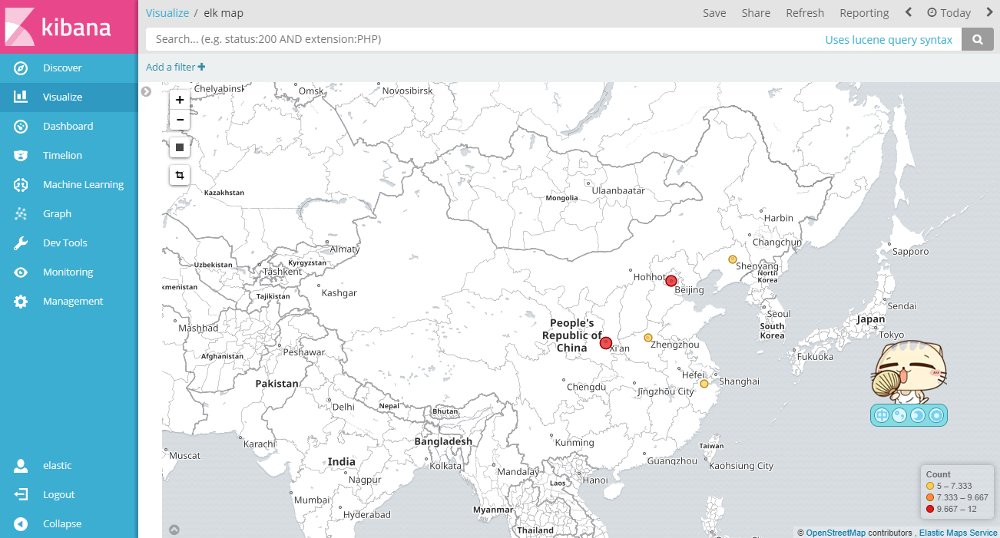

# GeoIP

## logstash-filter-geoip

`./bin/logstash-plugin list --verbose | grep geoip`

logstash-filter-geoip (4.2.1)

This plugin is bundled with GeoLite2 City database out of the box.

`logstash-5.5.1/vendor/bundle/jruby/1.9/gems/logstash-filter-geoip-4.2.1-java/vendor/GeoLite2-City.mmdb`

## MaxMind DB

MaxMind’s GeoIP2 database, only .mmdb (MaxMind DB) format is supported

## REF

- [geoip_filter](https://www.elastic.co/guide/en/logstash/5.6/breaking-changes.html#_geoip_filter)
- [plugins-filters-geoip](https://www.elastic.co/guide/en/logstash/5.6/plugins-filters-geoip.html)
- [GeoLite2 Free Downloadable Databases](https://dev.maxmind.com/geoip/geoip2/geolite2/)
